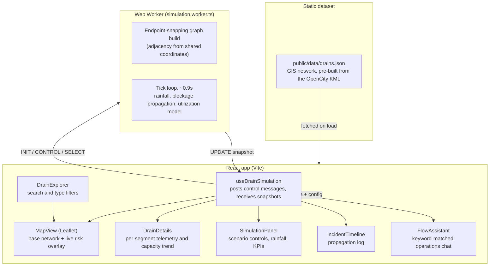

# UrbanFlow: architecture

A frontend-only atlas of Bengaluru's mapped stormwater drain network, with a
browser-side scenario engine layered on top. There is no server, database, or
API key involved anywhere in the running app.

## System diagram

## What is real and what is simulated

The mapped geometry, drain hierarchy (primary/secondary/tertiary), recorded
lengths, and source identifiers come directly from OpenCity's public BBMP
stormwater drain dataset. `frontend/scripts/build-drain-data.mjs` converts the
source KML into the static `frontend/public/data/drains.json` the app fetches
at load time.

Everything downstream of that fetch (rainfall, capacity, water level, flow,
topology direction, and incidents) is a deterministic demo model computed in
`frontend/src/workers/simulation.worker.ts`. It is clearly labeled as
simulated in the UI wherever it appears. There is no live weather feed, no
hydraulic sensor input, and no telemetry hardware.

## The simulation worker

On `INIT`, the worker snaps segment endpoints into a coordinate-bucketed
adjacency graph (`SNAP_TOLERANCE`), which stands in for real drain topology.
Every tick it recomputes, per segment: a rainfall load (uniform under the
baseline scenario, a distance-weighted storm cell under cloudburst), a
blockage pressure that decays with graph distance from an injected
obstruction, and a small deterministic oscillation seeded from the segment
id. Utilization crossing 68% or 90% moves a segment into `watch` or
`critical`; an active blockage forces `blocked` regardless of utilization.
Status transitions emit entries into the propagation log.

Running the model in a Web Worker keeps the tick loop (recomputing telemetry
for all ~6,800 segments several times a second) off the main thread, so the
map and UI stay responsive during a cloudburst scenario.

## The on-device assistant

`FlowAssistant` is a keyword-intent matcher, not a model call. It pattern-matches
the operator's message against regexes for scenario control ("start a
cloudburst", "block this drain"), rainfall and speed changes, filters, and
status questions, then reads the answer straight from the current simulation
snapshot and dataset metadata. It runs entirely in the browser with no network
request and no external AI dependency.

## Why frontend-only

An earlier version of this project ran a FastAPI backend with a real Gemini
API integration for causal disambiguation and debris classification. For a
software demo with no field hardware and no live sensor feed, that backend
added a process to run, a key to manage, and a network dependency for a
judgment step that a deterministic model can approximate well enough for
demo purposes. The current version trades that real inference step for a
build that runs from a single static bundle, works offline once loaded, and
has nothing that can fail during a live demo besides the browser tab.

## Pitch framing that still holds

UrbanFlow is a per-drain operational view that neither city-scale rainfall
forecasting nor a flat threshold alert can provide: it shows how utilization,
water level, and flow at one segment relate to the segments upstream and
downstream of it, and how a single obstruction propagates pressure across the
graph as rainfall continues.
