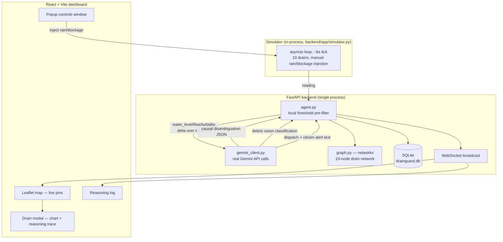

# DrainGuard — as-built architecture (software-only demo)

Trimmed from the original full-deployment blueprint down to what actually runs
for the hackathon: two local processes, SQLite, real Gemini calls, zero
hardware, zero external delivery integrations.

## System diagram

## The judgment step

Unchanged in spirit from the original doc: Gemini receives current telemetry,
a rolling baseline, and a text summary of upstream/downstream neighbor
readings (from the networkx graph), and returns a structured
`{classification, blockage_probability, reasoning, trigger_visual_triage}`
object via the `google-genai` SDK's `response_schema` (Pydantic model) —
guaranteed-shape JSON, no free-text parsing. `blockage_probability >= 70`
(configurable) triggers debris vision classification against a staged camera
frame, also via a schema-constrained Gemini call.

## AI tool assignment (as built)

| Task | Tool |
|---|---|
| Causal disambiguation (rain vs. blockage) | Gemini Flash, `response_schema`-constrained JSON |
| Debris vision classification | Gemini Pro (multimodal), `response_schema`-constrained JSON |
| Graph-context narrative | networkx (deterministic traversal) + Gemini Flash for the plain-language explanation |
| Dispatch / citizen alert copy | Gemini Flash, free-text |
| Everything else (backend/frontend code) | written directly, no product dependency on any specific coding tool |

## What was cut, and why

| Original doc | Cut to | Why |
|---|---|---|
| Mosquitto MQTT + ESP32 hardware rig | Simulator runs in-process, calls the agent pipeline directly | No hardware for a software demo; MQTT adds a moving part with zero payoff at this scale |
| TimescaleDB + PostGIS + S3/GCS | SQLite file, static in-repo demo images | 10 drains, a few thousand rows — SQLite is instant to set up and plenty fast |
| Docker Compose stack | Two local dev processes (`uvicorn`, `vite`) | Faster to start, easier to debug, nothing to containerize at this scale |
| Google ADK orchestrator | Direct `google-genai` SDK calls from `agent.py` | ADK's primitives (sequential/parallel sub-agents) aren't needed for a 4-step pipeline; keeps the dependency surface small for demo reliability |
| Three.js digital twin | Cut entirely | Pure polish, zero functional dependency, cut for time per project decision |
| WhatsApp Business Cloud API + Twilio/MSG91 SMS | Dispatch/alert text generated by Gemini and shown in the UI, not sent anywhere | Real delivery needs Meta template approval / TRAI DLT registration with real lead time; per project decision, skipped rather than mocked as a fake chat feed |
| Flood Hub / KSNDMC upstream context | Not integrated | No public real-time key on hackathon timelines (per original doc's own caveat); network-graph neighbor context substitutes for the "is this isolated to one node" signal |

## Pitch framing that still holds

DrainGuard is the causal, per-drain layer that neither city-scale rainfall
forecasting (Flood Hub, KSNDMC's Urban Flood Model) nor generic threshold
alerting can provide: it looks at flow velocity, turbidity, and graph
context together to tell a control-room operator *why* a drain is behaving
abnormally, not just *that* it is.
