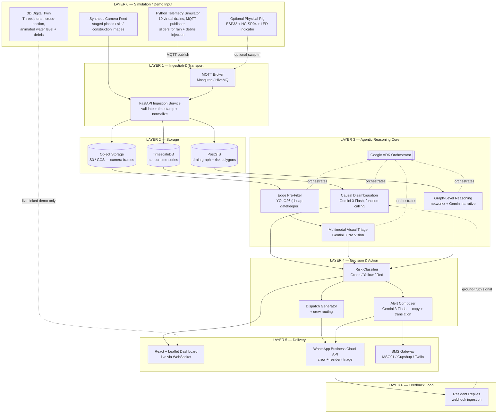
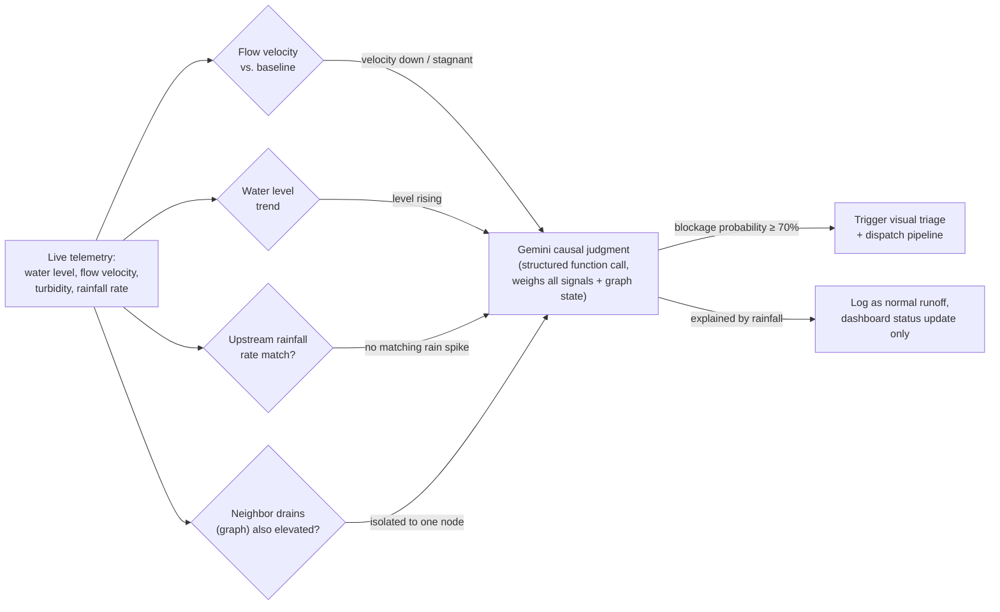
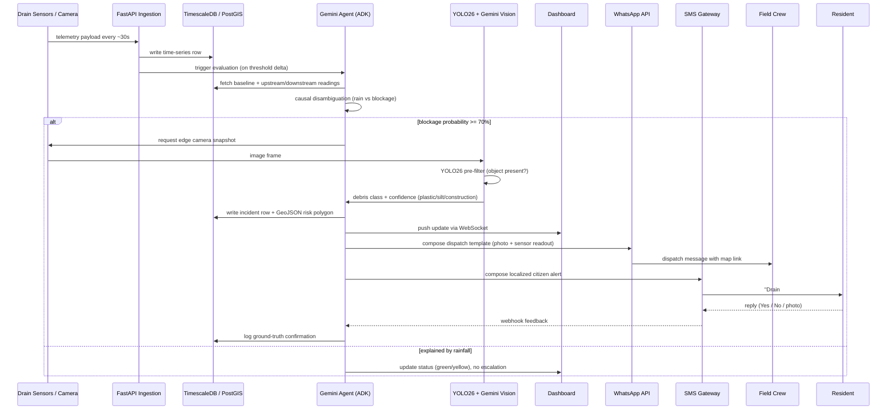

# DrainGuard — End-to-End Architecture & Build Blueprint

*A hand-off doc for rapid prototyping. Everything below maps directly to a repo structure your teammate can start scaffolding today.*

---

## 0. One-paragraph brief

DrainGuard ingests sensor + weather + camera telemetry from (simulated) drain nodes, stores it, and hands it to a **Gemini-orchestrated agent** that decides *why* a drain is behaving abnormally — heavy rain vs. physical blockage — before escalating to visual debris classification, dispatch generation, a live map dashboard, and WhatsApp/SMS alerts to crews and residents. The stack below is chosen for two things simultaneously: **hackathon demo speed** and **a credible path to a real deployment**.

---

## 1. Full System Architecture



**Read it top to bottom**: raw signals → transport → storage → an agent that *reasons* (not just thresholds) → a decision layer that turns reasoning into action → three delivery surfaces → a feedback loop that closes back into the agent's context for the next cycle.

---

## 2. The judgment step, isolated

This is the part judges will actually probe: *how does the agent decide "blockage" vs "just rain"?* It's a weighted read across three signals plus graph context, not a single threshold.



The trick that makes this reliable rather than vibes-based: you force Gemini to respond through a **JSON schema / function-calling contract**, not free text. See §5 for the exact schema. This is also what makes the output deterministic enough to drive UI state.

---

## 3. One full cycle, sequenced (sensor → citizen's phone)



---

## 4. AI tool assignment — what runs where, and why

Split this into two buckets, because they're answering different constraints: **what powers the product** (must satisfy "Gemini & related tools only") vs **what powers your dev workflow** (no such constraint — use whatever ships the demo fastest).

### 4.1 Inside the product

| Task | Tool | Why this one |
|---|---|---|
| Causal reasoning (rain vs. blockage), continuous polling | **Gemini 3 Flash** with structured output/function calling | Cheap and fast enough to run per-drain, per-cycle across 10 nodes without burning budget |
| Deep/ambiguous cases, final classification write-up | **Gemini 3 Pro** | Stronger reasoning when the Flash pass is inconclusive or multiple signals conflict |
| Edge pre-filter before invoking a vision LLM | **YOLO26** (Ultralytics, edge-optimized, Jan 2026 release) | NMS-free, quantization-stable, runs cheaply on a Pi/Jetson-class device or even in-browser for the sim. Its only job: "is there something in frame worth a Gemini call?" This is a real cost lever — you don't want to hit a vision LLM on every idle frame |
| Full debris classification (plastic / silt / construction debris) | **Gemini 3 Pro Vision** (multimodal) | Zero-shot classification into your 3 dispatch classes with a written rationale — no training data needed, which matters a lot at hackathon speed |
| Agent orchestration / tool-calling glue across the 4 reasoning components | **Google Agent Development Kit (ADK)** | Gemini-native, code-first (Python/TS), built-in Sequential/Parallel/Loop agent primitives, evaluation + observability out of the box, and it satisfies the rulebook's "Gemini & related tools" constraint directly — this is the single highest-leverage infra choice for the judging criteria |
| Graph-level cross-drain reasoning (DAG of drains) | **networkx** (deterministic graph traversal) handing state to **Gemini** for the narrative explanation | Keep the graph math deterministic; let Gemini explain *why* a pattern matters in plain language for the dashboard modal |
| Alert copy generation, incl. Kannada/English localization | **Gemini 3 Flash** | Cheap, fast, good at short templated copy + translation on demand |
| Crew routing optimization (stretch goal) | Google Maps Directions API, or OR-Tools if you want it self-hosted | Don't build routing from scratch under time pressure |

A note on model IDs: Google renames/rotates preview strings fairly often (e.g. `gemini-3-flash-preview` in current docs). Pull the exact current model string from Google AI Studio / Vertex AI at build time rather than hardcoding what's in this doc.

### 4.2 For your own dev speed ("vibe coding" layer — not shipped in the product)

| Task | Tool |
|---|---|
| Scaffolding the FastAPI backend, MQTT plumbing, DB schemas | Claude Code / Gemini Code Assist / Cursor — whichever your team already has muscle memory in |
| Generating the React + Leaflet dashboard shell fast | Same as above; Leaflet + OSM tiles is well-trodden enough that any coding agent handles it cleanly |
| The 3D digital twin | Hand-roll a simple Three.js scene (cylinder = pipe, animated water plane, particle debris), or use **Spline** if someone on the team wants a no-code 3D editor that exports to a React component — faster than writing raw Three.js under time pressure |

Keep this distinction visible in your pitch: the *product's intelligence* is 100% Gemini-family; the *tools you used to write the code* are irrelevant to that rule and can be whatever's fastest.

---

## 5. Data contracts (copy these into the repo verbatim, adjust from there)

### 5.1 MQTT / ingestion payload (sensor + camera node → FastAPI)

```json
{
  "drain_id": "BLR-ORR-042",
  "timestamp": "2026-09-16T14:32:00Z",
  "telemetry": {
    "water_level_cm": 85,
    "flow_velocity_mps": 0.12,
    "turbidity_ntu": 420
  },
  "weather": {
    "precip_rate_mm_hr": 4.5,
    "upstream_precip_mm_hr": 3.0
  },
  "camera_frame_url": "s3://drainguard-frames/BLR-ORR-042/1758033120.jpg"
}
```

### 5.2 Gemini function-calling schema (the causal disambiguation call)

```json
{
  "name": "classify_drain_anomaly",
  "description": "Given current and baseline telemetry for a drain node, classify whether the anomaly is explained by rainfall or indicates a physical blockage.",
  "parameters": {
    "type": "object",
    "properties": {
      "drain_id": { "type": "string" },
      "classification": {
        "type": "string",
        "enum": ["normal_runoff", "probable_blockage", "confirmed_blockage"]
      },
      "blockage_probability": { "type": "number", "minimum": 0, "maximum": 100 },
      "reasoning": { "type": "string" },
      "trigger_visual_triage": { "type": "boolean" }
    },
    "required": ["drain_id", "classification", "blockage_probability", "trigger_visual_triage"]
  }
}
```

### 5.3 WhatsApp dispatch template (crew-facing, image header + dynamic body)

```json
{
  "to": "+91XXXXXXXXXX",
  "type": "template",
  "template": {
    "name": "drain_dispatch_alert",
    "language": { "code": "en" },
    "components": [
      {
        "type": "header",
        "parameters": [{ "type": "image", "image": { "link": "<camera_frame_url>" } }]
      },
      {
        "type": "body",
        "parameters": [
          { "type": "text", "text": "BLR-ORR-042" },
          { "type": "text", "text": "Construction debris — Class 3" },
          { "type": "text", "text": "93% confidence" },
          { "type": "text", "text": "Heavy desilting crew" }
        ]
      }
    ]
  }
}
```

Note: WhatsApp templates must be pre-approved in Meta's WhatsApp Manager before use, and free-form messages only work inside a 24-hour customer-service window — outside that window you *must* use an approved template. Budget a day for template approval before demo day if you want this live rather than mocked.

### 5.4 SMS citizen alert (India-specific)

Plain-text SMS to Indian numbers legally requires **TRAI DLT registration** (entity ID, sender header, and template approval on a DLT platform like Airtel/Jio/Vi's portals, done through your aggregator — MSG91, Gupshup, Twilio, Plivo all support this). This takes real-world lead time (days), so for the hackathon demo either:
- use your aggregator's sandbox/test-number mode, or
- route the "citizen alert" leg through WhatsApp only for the live demo, and show the DLT-registered SMS path as an architecture slide + a pre-recorded clip.

Either is fine for judging — just don't try to register DLT the morning of the demo.

---

## 6. Existing systems to integrate with, not reinvent

Judges will notice if you've built a rainfall-forecasting model from scratch when two credible ones already exist for this exact geography. Lean on them; put your differentiation entirely at the hyperlocal, causal, per-drain layer.

- **Google Flood Hub** — Google's public AI flood-forecasting platform, live since 2018 (piloted in India), now covering river basins in 150+ countries. As of 2026 it has extended beyond river forecasting into **urban flash-flood coverage** for dense cities — exactly your problem space. Treat it as an upstream context signal: pull its regional risk forecast into the causal-disambiguation call as a prior, rather than trying to out-forecast it.
- **KSNDMC's Urban Flood Model (UFM) for Bengaluru** — built by the Karnataka State Natural Disaster Monitoring Centre with IISc, this is the *actual existing sensor backbone* for the city: ~100 telemetric rain gauges across BBMP wards, 12 telemetric weather stations, and 26 water-level sensors (105 planned), feeding a 2D hydrological flood-inundation model. It's exposed publicly via the **Varunamitra** web portal and the **Bengaluru MeghaSandesha** mobile app, which already push SMS-based rainfall/flood alerts.
- **What this means for your pitch**: DrainGuard isn't competing with UFM's ward-level rainfall/inundation forecasting — it's the missing *causal, sub-surface, per-drain* layer that neither UFM nor Flood Hub can see (they both reason about rainfall-driven inundation, not "is this specific drain physically choked"). Framing DrainGuard as a complementary agent that consumes UFM/Flood Hub rainfall context and adds blockage diagnosis on top is a stronger, more fundable story than building a parallel weather stack.
- **Practical note**: neither UFM nor Flood Hub is guaranteed to hand you a public real-time API key on hackathon timelines. Mock their response shape (both publish enough public documentation on format) for the demo, and list "integration MoU with KSNDMC/BBMP" as a stated go-to-market step — this lines up with the B2G narrative you already have (AMRUT 2.0 funding).

---

## 7. Suggested repo layout

```
drainguard/
├── simulator/                # Layer 0
│   ├── sensor_sim.py          # publishes MQTT payloads per §5.1, sliders for rain/debris
│   ├── camera_sim/            # staged debris images per class
│   └── digital_twin/          # Three.js scene, standalone Vite app
├── ingestion/                 # Layer 1
│   ├── main.py                 # FastAPI app
│   ├── mqtt_listener.py
│   └── schemas.py
├── storage/                   # Layer 2
│   ├── migrations/             # TimescaleDB + PostGIS schema
│   └── docker-compose.yml
├── agent/                     # Layer 3
│   ├── adk_app.py               # ADK orchestrator entrypoint
│   ├── tools/
│   │   ├── causal_disambiguation.py
│   │   ├── visual_triage.py      # YOLO26 pre-filter + Gemini Vision call
│   │   └── graph_reasoning.py    # networkx DAG logic
│   └── prompts/
├── decision/                  # Layer 4
│   ├── risk_classifier.py
│   ├── dispatch.py
│   └── alert_composer.py
├── dashboard/                 # Layer 5 (frontend)
│   ├── src/
│   │   ├── MapView.tsx           # Leaflet
│   │   └── DrainModal.tsx        # telemetry graphs + Gemini reasoning trace
│   └── vite.config.ts
├── integrations/
│   ├── whatsapp_client.py
│   ├── sms_client.py
│   └── flood_hub_client.py      # mocked/live upstream context
└── docker-compose.yml           # mosquitto, timescaledb, postgis, redis, api
```

### Minimal `docker-compose.yml` to get local dev running today

```yaml
version: "3.9"
services:
  mosquitto:
    image: eclipse-mosquitto:2
    ports: ["1883:1883"]
  timescaledb:
    image: timescale/timescaledb-ha:pg16
    environment:
      POSTGRES_PASSWORD: drainguard
    ports: ["5432:5432"]
  redis:
    image: redis:7
    ports: ["6379:6379"]
  api:
    build: ./ingestion
    depends_on: [mosquitto, timescaledb, redis]
    ports: ["8000:8000"]
```

---

## 8. Build order (so the demo works even if you run out of time)

1. **Simulator → ingestion → DB**, no AI yet. Get raw telemetry flowing and visible in the DB. This alone de-risks everything downstream.
2. **Dashboard reading straight from DB** (poll or WebSocket) with the three-pin health map. Now you have something to show at any point.
3. **Causal disambiguation call** wired to Gemini 3 Flash with the §5.2 schema, triggered on ingestion. Log the raw reasoning string into the incident row — this is your "chain-of-thought" modal content for free.
4. **YOLO26 pre-filter + Gemini Vision classification**, gated behind the 70% threshold. Only build this after step 3 is reliable — it's the most demo-fragile part.
5. **WhatsApp dispatch**, mocked first (log to console/Slack), swapped for the real Cloud API once a template is approved.
6. **SMS to citizens**, sandbox mode is fine for demo day.
7. **3D digital twin**, wire last — it's pure demo polish and has zero dependency on the backend being correct.
8. **Feedback loop / resident reply webhook**, stretch goal — nice for the pitch narrative, cuttable under time pressure without breaking the core demo.

---

## Further reading

- [Google Flood Hub](https://sites.research.google/floods/) — public flood forecasting platform
- [KSNDMC — Urban Flood Monitoring](https://ksndmc.org/) — Bengaluru's existing rain-gauge/water-level sensor network and Varunamitra portal
- [Google Agent Development Kit docs](https://google.github.io/adk-docs/) — orchestration framework
- [Ultralytics YOLO26](https://docs.ultralytics.com/) — edge object detection
- [WhatsApp Business Platform — Cloud API docs](https://developers.facebook.com/docs/whatsapp/cloud-api) — template messages with media headers
- [TRAI DLT registration guide](https://www.trai.gov.in/) — mandatory for production SMS in India
